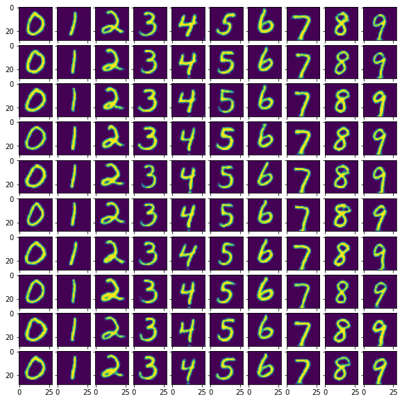

## Welcome to my GAN projects. 
Currently working on creating a simple GAN capable of producting images from MNIST dataset  
Code was developed on Spyder and split on blocks, may look weird on other editors

**Most updated project**: pytorch_gan.py  
GAN.ipynb is used mostly for experimenting

# Projects info:
## Simple GAN
1. **GAN.ipynb** - Used for experimenting
2. **pytorch_gan.py** - Working code, many  functions, needs some refactoring and cleaning
3. **gan_pytorch.pth.tar** - Checkpoint file for pretrained Generator and Discriminator 

## Conditional GANS
1. **conditional GAN** - cGAN that can produce 0-9 images from MNIST  
2. **gan_pytorch.pth.tar**- 1rst iteration of the model
3. **gan_pytorch6.pth.tar**- 6th, best yet iteration of the model

## Sample Images from cGAN Model:

